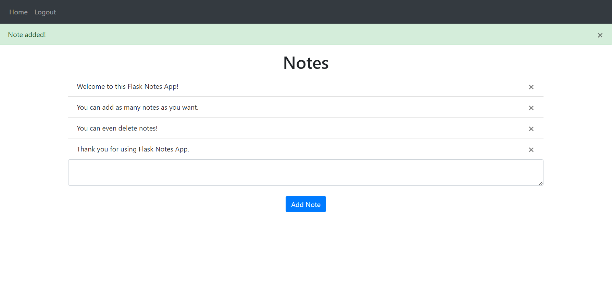
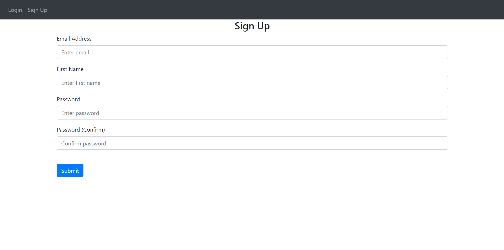
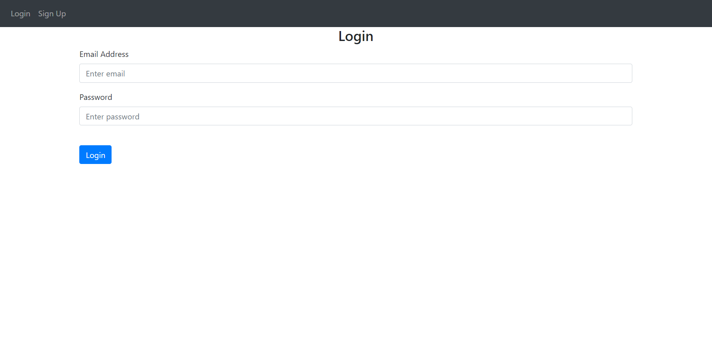

# Flask Notes App

This is a simple web-based notes app, developed in Flask.
It supports multi-user authentication.
Upon signing up, and logging in, users can create and delete as many notes as they desire.
The frontend is coded in HTML and CSS, while the backend is developed in Flask.
All the user and notes data is saved in an SQLite database.

## Setup & Installation

Please install the latest version of Python in your operating system.
Clone the repo as shown.

```bash
git clone <repo-url>
```

Install all the required libraries as follows.

```bash
pip install -r requirements.txt
```

## Running The App

Run the app from the command line.
```bash
python main.py
```

The app will run on port 5000. So you can view it by going to the following link on a browser.
Go to `http://127.0.0.1:5000`

## Screenshots

The notes page


The sign up page


The login page


